## 概述

**Euonia**（源自希腊语 *εὔνοια*，意为"美好的思维、善意、心态平和"）是一个面向企业级分布式应用的全栈开发框架，同时提供 **.NET** 与 **Java** 双语言实现。它将**面向对象可扩展业务架构（OSBA）**、**领域驱动设计（DDD）**、**消息总线**、**管道中间件**、**工作单元**等企业级架构模式集于一体，为开发者构建微服务、云原生应用和复杂分布式系统提供开箱即用的基础设施。

---

## 核心设计理念

Euonia 在两个技术栈上追求**架构一致性**与**语言惯用性**的平衡：

| 设计维度 | .NET 版本 | Java 版本 |
|---------|-----------|-----------|
| **目标平台** | .NET 8+ / .NET Standard 2.1+ | Java 17+（Sample 模块支持 Java 25 + Spring Boot 4.x） |
| **依赖注入** | 标记接口自动注册（`ITransientDependency` / `IScopedDependency` / `ISingletonDependency`） | Spring `ApplicationContext` 集成 + 自定义 `ServiceProvider` 桥接 |
| **模块化** | `Euonia.Modularity` 插件式模块生命周期管理 | Maven 多模块 + Spring `@Configuration` 自动装配 |
| **异步模型** | `Task` / `async-await` | `CompletionStage<T>` / `CompletableFuture<T>` |
| **消息传递** | Pipeline + IBus（Publish / Send / Call） | Pipeline + Bus（`publishAsync` / `sendAsync` / `callAsync`） |

---

## 模块架构对比

```mermaid
graph TB
    subgraph ".NET 生态"
        direction TB
        NET_Core["Euonia.Core<br/>基础工具/反射/异常"]
        NET_Modularity["Euonia.Modularity<br/>插件式模块化"]
        NET_Domain["Euonia.Domain<br/>DDD：Entity/Aggregate/ValueObject"]
        NET_Repository["Euonia.Repository<br/>通用仓储（EFCore/Mongo）"]
        NET_Bus["Euonia.Bus<br/>消息总线（InMem/RabbitMQ/ActiveMQ）"]
        NET_Caching["Euonia.Caching<br/>缓存抽象（Redis/Memory）"]
        NET_Osba["Euonia.Osba<br/>OSBA 业务对象"]
        NET_Uow["Euonia.Uow<br/>工作单元"]
        NET_Pipeline["Euonia.Pipeline<br/>管道中间件"]
        NET_Threading["Euonia.Threading<br/>分布式锁（ZK/Redis/Azure）"]
        NET_Mapping["Euonia.Mapping<br/>对象映射（AutoMapper/Mapster）"]
        NET_App["Euonia.Application<br/>应用服务/用例"]
    end

    subgraph "Java 生态"
        direction TB
        JV_Core["euonia-core<br/>基础工具/反射/ID生成/元组"]
        JV_DDD["euonia-ddd<br/>DDD：Entity/Aggregate/ValueObject/Event"]
        JV_Osba["euonia-osba<br/>OSBA 业务对象 + 规则引擎"]
        JV_Uow["euonia-uow<br/>工作单元"]
        JV_Pipeline["euonia-pipeline<br/>管道中间件"]
        JV_BusAbs["euonia-bus-abstract<br/>消息总线契约层"]
        JV_BusCore["euonia-bus-core<br/>消息总线运行时"]
        JV_BusMem["euonia-bus-inmemory<br/>内存传输"]
        JV_BusRabbit["euonia-bus-rabbitmq<br/>RabbitMQ 传输"]
        JV_BusKafka["euonia-bus-kafka<br/>Kafka 传输"]
        JV_Spring["euonia-spring<br/>Spring 集成桥接"]
    end

    NET_Core --> NET_Modularity
    NET_Modularity --> NET_Bus
    NET_Modularity --> NET_Caching
    NET_Core --> NET_Domain
    NET_Domain --> NET_Repository
    NET_Domain --> NET_Bus
    NET_Core --> NET_Osba
    NET_Core --> NET_Uow
    NET_Core --> NET_App

    JV_Core --> JV_DDD
    JV_Core --> JV_Osba
    JV_Core --> JV_Uow
    JV_Core --> JV_Pipeline
    JV_Core --> JV_BusAbs
    JV_BusAbs --> JV_BusCore
    JV_Pipeline --> JV_BusCore
    JV_BusAbs --> JV_BusMem
    JV_BusAbs --> JV_BusRabbit
    JV_BusAbs --> JV_BusKafka
    JV_Spring --> JV_Pipeline
    JV_Spring --> JV_Uow
    JV_Spring --> JV_Osba
```

---

## 共性能力

两个版本在以下核心领域提供一致的抽象：

### 1. 领域驱动设计（DDD）
- **Entity / Aggregate / ValueObject**：完整的领域对象层级，聚合根内建领域事件管理
- **DomainEvent / ApplicationEvent**：事件溯源（Event Sourcing）支持，事件携带 originator 元数据
- **审计（Auditing）**：`@Audited` 注解驱动的对象变更追踪

### 2. OSBA（面向对象可扩展业务架构）
- **富业务对象模型**：`BusinessObject` → `ObservableObject` → `EditableObject` / `ReadOnlyObject` / `ExecutableObject` 层级
- **规则引擎**：声明式规则（Lambda / 注解 / 自定义），异步校验，BrokenRule 收集
- **属性追踪**：反射驱动的属性元数据管理（`PropertyInfo` / `FieldDataManager`）
- **生命周期状态机**：`NONE → NEW → CHANGED → DELETED`
- **工厂模式**：注解/特性驱动的 CRUD 工厂（`@FactoryCreate` / `@FactoryFetch` 等）

### 3. 消息总线（Message Bus）
- **三种消息模式**：Publish（多播）、Send（单播）、Call（请求-响应）
- **约定系统**：基于接口标记或注解自动分类消息类型（Unicast / Multicast / Request）
- **传输策略**：消息类型 → 传输方式映射，支持本地（InMemory）与分布式（RabbitMQ / Kafka / ActiveMQ）
- **管道集成**：中间件风格的消息处理（日志、验证、转换等）

### 4. Pipeline 中间件
- 受 ASP.NET Core Middleware 启发的可链式行为拼装
- 统一类型化管道：`Pipeline<TRequest, TResponse>` 覆盖即发即忘和请求-响应场景
- Fluent API（`.use()`）+ 注解自动发现
- 全链路异步执行

### 5. Unit of Work（工作单元）
- 事务边界管理：`commit` / `rollback` / `saveChanges`
- 嵌套工作单元支持（Outer / Inner / Child）
- AOP 拦截器（`UnitOfWorkInterceptor`）

---

## .NET 版本独有特性

| 模块 | 说明 |
|------|------|
| **Euonia.Modularity** | 完整的插件式模块化框架，`IModuleLifecycle` 生命周期管理 |
| **Euonia.Hosting** | AspNetCore 宿主抽象，中间件配置、请求追踪 |
| **Euonia.Repository** | 通用仓储抽象 + EF Core / MongoDB 实现，链式 LINQ 查询构建 |
| **Euonia.Caching** | 多级缓存抽象（Memory / Redis / Runtime），支持绝对/相对过期 |
| **Euonia.Threading** | 分布式同步原语（ZooKeeper / Redis / Azure / FileSystem） |
| **Euonia.Mapping** | AutoMapper / Mapster 适配器 |
| **Euonia.Validation** | FluentValidation 集成 |
| **Euonia.Grpc** | gRPC 健康检查与反射支持 |
| **Euonia.Quartz** | Quartz.NET 任务调度集成 |

---

## Java 版本独有特性

| 模块 | 说明 |
|------|------|
| **ID 生成策略** | `SnowflakeId`（Twitter 风格 64 位）、`ULID`（Crockford Base32）、`ObjectId`（多种策略统一入口） |
| **不可变元组** | 强类型元组 `Solo` ～ `Decet`（1～10 元素） |
| **HTTP 异常层次** | 完整的 HTTP 状态码异常映射（400～503） |
| **Spring 集成** | `ApplicationContextServiceProvider` 桥接，无缝融入 Spring Boot 生态 |
| **Bus 抽象层** | 独立的消息契约模块（`bus-abstract`），十种注解驱动消息分类与路由 |
| **信使引擎** | `StrongReferenceMessenger`（精确匹配）/ `WeakReferenceMessenger`（GC 自动退订）双模式引用管理 |
| **事件体系** | 完整的消息处理事件流：`Delivered → Received → Acknowledged → Replied → Handled` |

---

## 技术栈总览

| 维度 | .NET 版本 | Java 版本 |
|------|-----------|-----------|
| **语言** | C# | Java |
| **构建工具** | MSBuild / dotnet CLI | Maven |
| **IoC 容器** | Autofac / Microsoft.Extensions.DI | Spring Framework |
| **数据访问** | EF Core, MongoDB.Driver | Spring Data JPA（Sample） |
| **消息中间件** | RabbitMQ.Client, Apache.NMS (ActiveMQ) | RabbitMQ AMQP Client, Kafka |
| **缓存** | StackExchange.Redis, MemoryCache | — |
| **映射** | AutoMapper, Mapster | — |
| **调度** | Quartz.NET | — |
| **RPC** | gRPC (Google.Protobuf) | — |
| **日志** | Serilog | SLF4J / Logback（Spring Boot 默认） |
| **分布式锁** | ZooKeeper, Redis, Azure | — |
| **API 文档** | Swashbuckle (Swagger) | SpringDoc OpenAPI（Sample） |

---

## 设计模式与架构风格

Euonia 贯穿以下企业级设计模式：

1. **DDD（领域驱动设计）**：Entity、Aggregate、ValueObject、DomainEvent、Repository
2. **CQRS 就绪**：命令/查询分离的消息模型
3. **管道-过滤器**：中间件风格的可组合行为链
4. **工厂模式**：反射驱动的 CRUD 工厂 + 策略模式（ID 生成、缓存后端、传输协议）
5. **观察者模式**：属性变更通知、领域事件发布、消息处理事件流
6. **工作单元**：事务边界管理与一致性保障
7. **模板方法**：`addRules()`、`initialize()`、`onBusinessContextSet()` 生命周期钩子
8. **适配器模式**：缓存（多后端）、映射（AutoMapper/Mapster）、消息传输（多协议）

---

## 项目定位

Euonia 是一个**架构框架**而非单纯的工具库。它不绑定特定的业务领域，而是提供企业级应用开发所需的横切关注点（Cross-cutting Concerns）和架构脚手架，让开发团队能够专注于核心业务逻辑的实现。无论是 .NET 还是 Java 技术栈，Euonia 都提供了连贯一致的编程模型，降低跨技术栈团队的认知负担，加速分布式系统的构建与交付。

---

## 仓库

| 语言 | 仓库 |
|------|------|
| .NET | [euonia-dotnet](https://github.com/euonia-project/euonia-dotnet) |
| Java | [euonia-java](https://github.com/euonia-project/euonia-java) |
