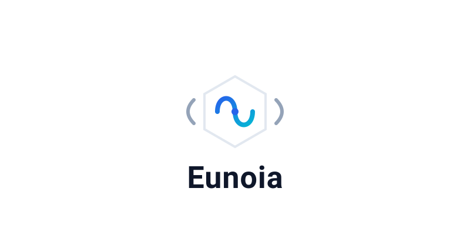

## 概述

**Euonia**（源自希腊语 *εὔνοια*，意为"美好的思维、善意、心态平和"）是一个面向企业级分布式应用的全栈开发框架，同时提供 **.NET** 与 **Java** 双语言实现。它将**面向对象可扩展业务架构（OSBA）**、**领域驱动设计（DDD）**、**消息总线**、**管道中间件**、**工作单元**等企业级架构模式集于一体，为开发者构建微服务、云原生应用和复杂分布式系统提供开箱即用的基础设施。

---

## 核心模块

两个版本在以下核心领域提供一致的抽象：

### 1. 领域驱动设计（DDD）
- **Entity / Aggregate / ValueObject**：完整的领域对象层级，聚合根内建领域事件管理
- **DomainEvent / ApplicationEvent**：事件溯源（Event Sourcing）支持，事件携带 originator 元数据
- **审计（Auditing）**：`@Audited` 注解驱动的对象变更追踪

### 2. OSBA（面向对象可扩展业务架构）
- **富业务对象模型**：`BusinessObject` → `ObservableObject` → `EditableObject` / `ReadOnlyObject` / `ExecutableObject` 层级
- **规则引擎**：声明式规则（Lambda / 注解 / 自定义），异步校验，BrokenRule 收集
- **属性追踪**：反射驱动的属性元数据管理（`PropertyInfo` / `FieldDataManager`）
- **生命周期状态机**：`NONE → NEW → CHANGED → DELETED`
- **工厂模式**：注解/特性驱动的 CRUD 工厂（`@FactoryCreate` / `@FactoryFetch` 等）

### 3. 消息总线（Message Bus）
- **三种消息模式**：Publish（多播）、Send（单播）、Call（请求-响应）
- **约定系统**：基于接口标记或注解自动分类消息类型（Unicast / Multicast / Request）
- **传输策略**：消息类型 → 传输方式映射，支持本地（InMemory）与分布式（RabbitMQ / Kafka / ActiveMQ）
- **管道集成**：中间件风格的消息处理（日志、验证、转换等）

### 4. Pipeline 中间件
- 受 ASP.NET Core Middleware 启发的可链式行为拼装
- 统一类型化管道：`Pipeline<TRequest, TResponse>` 覆盖即发即忘和请求-响应场景
- Fluent API（`.use()`）+ 注解自动发现
- 全链路异步执行

---

## 设计模式与架构风格

Euonia 贯穿以下企业级设计模式：

1. **DDD（领域驱动设计）**：Entity、Aggregate、ValueObject、DomainEvent、Repository
2. **CQRS 就绪**：命令/查询分离的消息模型
3. **管道-过滤器**：中间件风格的可组合行为链
4. **工厂模式**：反射驱动的 CRUD 工厂 + 策略模式（ID 生成、缓存后端、传输协议）
5. **观察者模式**：属性变更通知、领域事件发布、消息处理事件流
6. **工作单元**：事务边界管理与一致性保障
7. **模板方法**：`addRules()`、`initialize()`、`onBusinessContextSet()` 生命周期钩子
8. **适配器模式**：缓存（多后端）、映射（AutoMapper/Mapster）、消息传输（多协议）

---

## 项目定位

Euonia 是一个**架构框架**而非单纯的工具库。它不绑定特定的业务领域，而是提供企业级应用开发所需的横切关注点（Cross-cutting Concerns）和架构脚手架，让开发团队能够专注于核心业务逻辑的实现。无论是 .NET 还是 Java 技术栈，Euonia 都提供了连贯一致的编程模型，降低跨技术栈团队的认知负担，加速分布式系统的构建与交付。